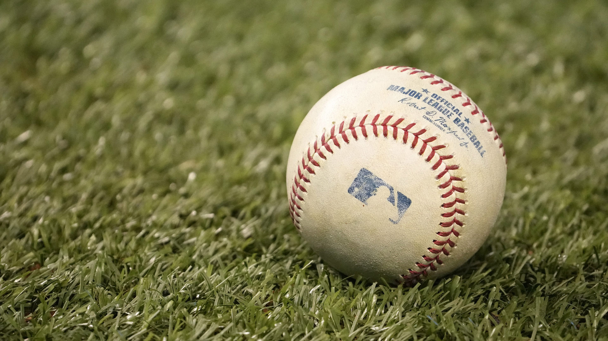

# Engineering_4_Notebook

&nbsp;

## Table of Contents
* [Raspberry_Pi_Assignment_Template](#raspberry_pi_assignment_template)
* [Onshape_Assignment_Template](#onshape_assignment_template)

&nbsp;

## Countdown

### Countdown on serial moniter from ten, then print "LIFTOFF"

### Evidence 

import board
import digitalio
import time

for x in range(10, 0, -1):
  time.sleep(.5)
  print (x)
  time.sleep(.5)
time.sleep(.5)
print("liftoff")

### Wiring
None
### Code
https://github.com/tslingl25/Engineering_4_Notebook/blob/main/raspberry-pi/code.py

### Reflection
This assignment was good for learning for me as I feel like it was really the first time ive coded, it is good to ask your neighbors for help, Ezhar was very helpful.

&nbsp;

## Launch Pad Part 2 (Lights)

### Countdown from 10 seconds to 0 (liftoff). Print that countdown to the serial monitor.
Blink a red light each second of the countdown, and turn on a green LED to signify liftoff.

### Evidence 

### Wiring

### Code

### Reflection
This assignment included lots of laerning for me, there were no huge hang ups but it is definitly smart to copy your lines from old code as even the smallest thing can mess it up.

&nbsp;

## Launch Pad Part 3 (Button)

### Countdown from 10 seconds to 0 (liftoff). Print that countdown to the serial monitor.Blink a red light each second of the countdown, and turn on a green LED to signify liftoff.Include a physical button that starts the countdown. 

### Evidence 

### Wiring

### Code
# type: ignore
import board
import digitalio
import time

led = digitalio.DigitalInOut(board.GP15)
led2 = digitalio.DigitalInOut(board.GP16)
led.direction = digitalio.Direction.OUTPUT
led2.direction = digitalio.Direction.OUTPUT
button = digitalio.DigitalInOut(board.GP0)
button.direction = digitalio.Direction.INPUT
button.pull = digitalio.Pull.DOWN

while True:
  print(button.value)

  if(button.value == True):
    for x in range(10, 0, -1):
      time.sleep(.25)
      print (x)
      time.sleep(.25)
      led.value = True
      time.sleep(.25)
      led.value = False
      time.sleep(.25)
    time.sleep(.25)
    print("liftoff")
    while True:
      led2.value = True

### Reflection
This assignment was pretty straight foward. It may be helpful to know that the button has four legs but you only need 2.

## Table of Contents
* [Raspberry_Pi_Assignment_Template](#raspberry_pi_assignment_template)
* [Onshape_Assignment_Template](#onshape_assignment_template)

&nbsp;

## Launch Pad Part 4 (Servo)

### Description 
Countdown from 10 seconds to 0 (liftoff). Print that countdown to the serial monitor.Blink a red light each second of the countdown, and turn on a green LED to signify liftoff.Include a physical button that starts the countdown. Actuate a 180 degree servo on liftoff to simulate the launch tower disconnecting.

### Evidence 

### Wiring

### Code
https://github.com/tslingl25/Engineering_4_Notebook/commit/125b7fe05469b8bc9d31bba48ebbf2503a5d9ebc

### Reflection
The assignment itself was not hard but github was being VERY difficult. It wouldnt let be put my gif in, then it would let me put my code in. If you find yourself with github being annoying, just upload stuff too it like 100 times then it will eventually work.

&nbsp;

## Crash Avoidance Part 1 (Accelerometer)

### Description 
The module must have an accelerometer that continuously reports x, y, and z acceleration values on the serial monitor.

### Evidence 

### Wiring
[Wiring](https://github.com/tslingl25/Engineering_4_Notebook/blob/main/images/WIN_20221011_14_01_31_Pro.jpg)
### Code
[https://github.com/tslingl25/Engineering_4_Notebook/blob/main/raspberry-pi/code.py
](https://github.com/tslingl25/Engineering_4_Notebook/blob/main/raspberry-pi/crashaviodence.py)
### Reflection
Assignment was straight forward but make sure you READ DIRECTIONS. It is easy to miss small but important things.

&nbsp;

## Crash Avoidance Part 2 (Light + Powerboost)

### Description
The module must have an accelerometer that continuously reports x, y, and z acceleration values.The module must have an LED that turns on if the helicopter is tilted to 90 degrees. The module must be powered by a mobile power source. 

### Evidence

### Wiring
[Wiring](https://github.com/tslingl25/Engineering_4_Notebook/blob/main/images/WIN_20221011_14_01_31_Pro.jpg)
### Code
https://github.com/tslingl25/Engineering_4_Notebook/blob/main/raspberry-pi/code.py

### Reflection
This assignment was good for learning for me as I feel like it was really the first time ive coded, it is good to ask your neighbors for help, Ezhar was very helpful.

&nbsp;

## Onshape_Assignment_Template

### Assignment Description

Write your assignment description here. What is the purpose of this assignment? It should be at least a few sentences.

### Part Link 

[Create a link to your Onshape document](https://cvilleschools.onshape.com/documents/003e413cee57f7ccccaa15c2/w/ea71050bb283bf3bf088c96c/e/c85ae532263d3b551e1795d0?renderMode=0&uiState=62d9b9d7883c4f335ec42021). Don't forget to turn on link sharing in your Onshape document so that others can see it. 

### Part Image

Take a nice screenshot of your Onshape document. 

### Reflection

What went wrong / was challenging, how'd you figure it out, and what did you learn from that experience? Your goal for the reflection is to pass on knowledge that will make this assignment better or easier for the next person. Think about your audience for this one, which may be "future you" (when you realize you need some of this code in three months), me, or your college admission committee!

&nbsp;

## Media Test

Your readme will have various images and gifs on it. Upload a test image and test gif to make sure you've got the process figured out. Pick whatever image and gif you want!

### Test Link
[earth](https://www.google.com/maps)
### Test Image

### Test GIF
 

